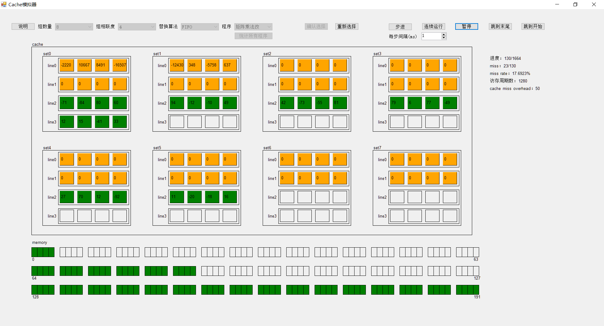
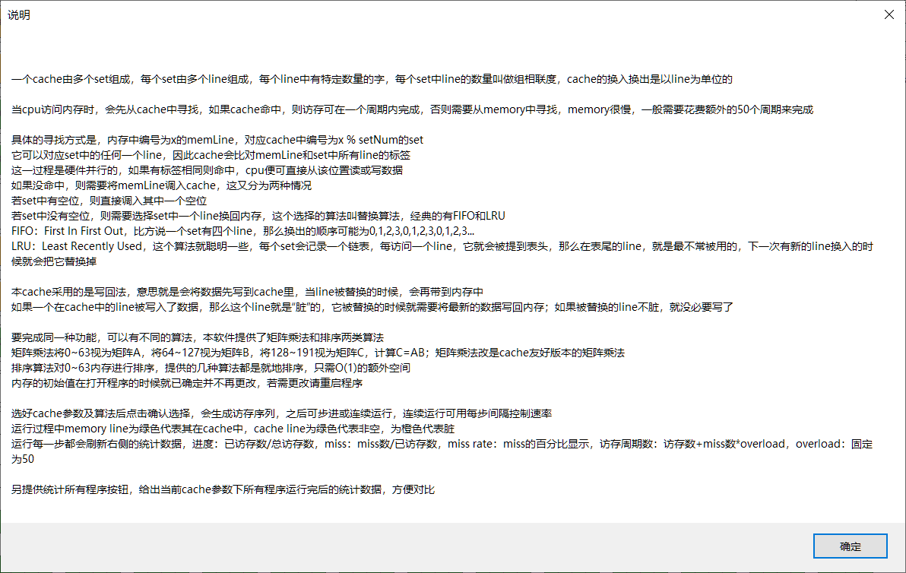
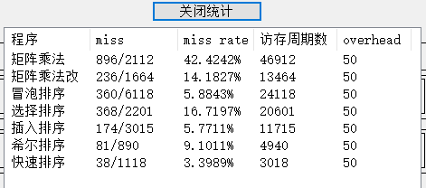

# Cache模拟器

## 界面介绍

界面总体分为上下两部分

上面是控制栏，左边可以调整cache参数、更改程序；确认选择后，右侧可以控制程序运行；最左侧还有一说明按钮

下面是显示区域，左侧有cache和memory的可视化显示，右侧有进度以及cache指标；memory中绿色的line代表其在cache中；cache中绿色和橙色都代表line非空，橙色代表该line是脏的，绿色代表非脏

说明如下

程序下有“统计所有程序按钮”，点击后会以所选cache参数运行所有程序并给出统计结果

